# Architecture

## Flow: identity → claims → verification → policy

```mermaid
flowchart LR
    A["New agent<br/>createAgent()"] --> B["Real Ed25519<br/>key pair generated"]
    B --> C["Identity registered<br/>(public key shared,<br/>private key stays secret)"]
    C --> D["Issuer grants credential<br/>grantCredential()"]
    D --> E["Claim signed with<br/>issuer's private key"]
    E --> F["Credential stored<br/>(active, with expiry)"]
    F --> G["Task requested<br/>decideTask()"]
    G --> H["findValidCredential()<br/>looks for matching scope"]
    H --> I["Signature verified<br/>against issuer's public key"]
    I -->|"valid + active + not expired"| J["ACCEPT"]
    I -->|"missing, forged,<br/>revoked, or expired"| K["REFUSE"]
```

## What each stage does

**Identity.** `createAgent()` generates a real Ed25519 key pair using Node's built-in `crypto` module — not a fake ID. The public key is shareable (it's how others verify this agent's signatures later); the private key never leaves the agent that owns it.

**Claims (credentials).** A credential is a signed statement: "issuer X says agent Y may do Z, until this date." `issueCredential()` builds the claim, then signs it with the issuer's private key using `crypto.sign()`. The signature covers every field of the claim — id, issuer, subject, statement, scope, issued date, expiry — so changing any single character invalidates the signature.

**Verification.** `verifySignature()` and `isCredentialValid()` check a credential four ways: is the signature mathematically valid against the issuer's public key, is the credential still `active` (not revoked), has it not expired. All four must pass. This is real cryptographic verification, not a lookup in a trust table.

**Policy.** `decideTask()` is the single place every trust decision is made. It calls `findValidCredential()`, which searches for a credential matching the requester and the exact scope needed, and only returns one that passes verification. No domain file makes its own trust decision — they all route through this one function.

**Domains.** `paymentAuthorization.ts`, `deploymentAuthorization.ts`, and `dataAccessAuthorization.ts` are thin wrappers. Each one's only job is to translate a real-world request into a scope string (like `payment:approve` or `deploy:production`) and hand it to `decideTask()`. None of them know how trust is verified — that logic lives in exactly one place.

## Why this shape

If I ever need to change how credentials expire, or add a new check (say, rate-limiting how many credentials one issuer can grant), I change `decide.ts` or `credentials.ts` once, and every domain inherits the new behavior automatically. Adding a fourth domain — say, "can this agent send emails on our behalf" — means writing one new small wrapper file, not touching the trust engine at all.

This also means the trust engine can be audited on its own, separately from any specific use case. A reviewer doesn't need to understand payments or deployments to check whether the cryptography is sound — it's isolated in `src/trust/`.